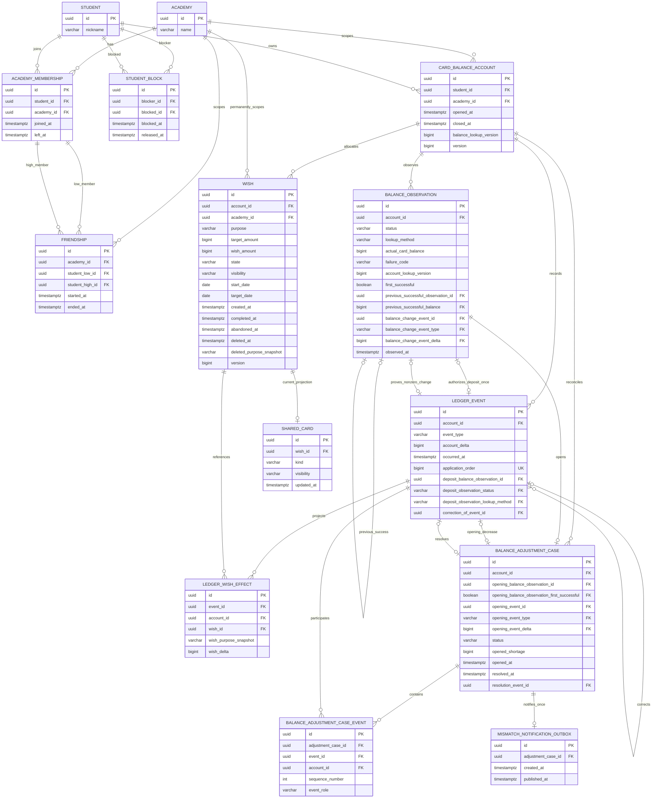

# 위시 데이터 모델과 DB 무결성

> 문서 탐색: [백엔드 문서 홈](../../README.md)에서 전체 문서 지도와 권위 경계를 확인한다. 이 문서는 데이터 모델과 DB 무결성의 저장소 기준 설명이며, HTTP 목표 계약은 [api/openapi.yaml](../../api/openapi.yaml)에 있다.

이 문서는 위시 기능의 도메인 용어, 관계, 금액과 상태 불변 조건, 트랜잭션 경계를 고정한다. 모든 금액은 소수점 없는 `BIGINT` 원화(KRW)이고 Java에서는 `KrwAmount`로 표현한다. 버전 관리되는 HTTP 목표 계약은 `api/openapi.yaml`에 있고, 현재 구현된 컨트롤러 표면은 실행 중 Springdoc 경로에서 확인한다. PostgreSQL schema와 변경 이력은 `src/main/resources/db/migration/`의 Flyway migration이 관리한다.

## 구현 패키지 구조

`com.crabit.backend`의 직접 하위 패키지를 기술 계층이 아니라 변경 이유가 같은 기능 Module로 나눈다.

| Module | 책임 | 의존 방향 |
|---|---|---|
| `account` | Student, Academy, Academy Membership, Card Balance Account 소유권 | 없음 |
| `relationship` | Friendship, Student Block, 현재 Relationship Context 판정과 변경 | `relationship -> account` |
| `wish` | Wish, Ledger Event, Balance Observation, Balance Adjustment Case, Shared Card | `wish -> account` |

Repository Interface는 해당 Aggregate와 같은 Module에 둔다. 현재 Repository마다 Spring Data JPA Adapter 하나만 있으므로 별도의 전역 `persistence` 패키지나 pass-through port를 만들지 않는다. 이를 통해 하나의 규칙을 바꿀 때 관련 Implementation과 테스트가 같은 위치에 머무르는 Locality를 유지한다. DB 테이블명, FK, check, index는 Java 패키지와 독립적이며 이 구조 변경으로 달라지지 않는다.

## IE 방식 ERD

아래 다이어그램은 IE(Information Engineering) 크로우즈 풋 표기법을 사용한다. `||`는 정확히 하나, `o|`는 0 또는 1, `o{`는 0개 이상을 뜻하며 각 엔터티에는 구현 기준 PK, FK, 주요 필드를 표시한다.



`card_balance_account`는 실물 카드가 아니라 학생과 학원에 귀속된 논리 계정이다. 카드 재발급은 이 식별자를 바꾸지 않는다. `wish.account_id`와 `wish.academy_id`는 생성 후 변경하지 않는다.
`wish(account_id, academy_id)`는 `card_balance_account(id, academy_id)`를 함께 참조하는 복합 FK다. 따라서 존재하는 계정 ID를 사용하더라도 다른 학원의 위시를 연결할 수 없다. 같은 원칙으로 `ledger_wish_effect(event_id, account_id)`와 `(wish_id, account_id)`, 조정 case의 opening/resolution 및 `balance_adjustment_case_event`, observation의 이전 성공 조회와 잔액 변경 event, 입금 원장의 proof, 보정 원장의 원사건을 모두 계정 ID와 함께 복합 FK로 묶는다. 입금 proof는 `(observation_id, account_id, status, lookup_method)` candidate key를 참조하고 local check가 `WISH_DEPOSIT`에만 `SUCCEEDED`, `PRE_DEPOSIT`을 강제한다. observation ID의 기존 nullable unique도 유지해 동일 성공 조회를 두 입금 event가 영구 재사용하지 못한다. observation은 이전 관측의 실제 잔액과 event의 type/delta/occurred_at도 복합 FK에 포함하여 `observed_at`과 정확히 같은 시각의 원장 사실만 참조한다. 조정 case는 `opening_balance_observation_id/account_id/opened_at` 복합 FK로 같은 계정·같은 시각의 성공 관측을 필수 origin으로 삼는다. 실제 감소가 origin이면 선택적 opening event가 그 관측의 정확한 `CARD_BALANCE_CHANGE` ID/type/delta/time과 일치해야 하고 음수여야 한다. opening event가 없으면 별도 first-success 복합 proof가 그 관측이 Unknown Card Balance에서 온 최초 성공임을 강제한다. friendship의 양쪽 학생도 `(student_id, academy_id)`로 membership을 참조한다. 원장 projection, 조정 회차, 잔액 관측, 친구 관계는 다른 계정이나 학원의 사실을 참조할 수 없다.

ERD의 조정 case → event-link와 case → outbox 관계는 DB가 강제할 수 있는 `0..*`, `0..1` cardinality로 그렸다. 도메인/JPA lifecycle은 실제 감소가 있을 때만 첫 `OPENING_DECREASE` link를 추가하고, 최초 성공 부족이면 event link 없이 시작한다. 두 경우 모두 outbox 하나를 같은 트랜잭션에 추가하고 해결 시 resolution link를 마지막에 추가한다. FK와 unique만으로 부모 행에 자식이 반드시 존재한다고 과장하지 않는다.

## 데이터 사전

| 테이블 | 핵심 열 | 의미와 무결성 |
|---|---|---|
| `academy` | `id`, `name` | 위시와 카드 계정의 학원 범위 |
| `student` | `id`, `nickname` | 카드 계정 소유자. 공유 응답은 실명을 저장하거나 노출하지 않는다. 관계 command는 UUID 오름차순의 두 student 행을 공통 비관 잠금 경계로 사용한다. |
| `academy_membership` | `student_id`, `academy_id`, `joined_at`, `left_at` | 현재 학원 관계는 `left_at IS NULL`. 학생-학원 쌍은 유일하다. |
| `friendship` | `academy_id`, `student_low_id`, `student_high_id`, `started_at`, `ended_at` | 학원 범위 상호 친구 관계. 양쪽 학생의 `(student_id, academy_id)` membership이 존재해야 한다. UUID 문자열 순서가 작은 학생을 `low`에 두고 `(academy_id, low, high)`를 유일하게 하므로 같은 쌍은 학원별로 독립적이다. 현재 관계는 `ended_at IS NULL`. 종료 뒤 명시적 친구 맺기는 같은 academy-pair 행의 `started_at`을 새 시각으로 바꾸고 `ended_at`을 비워 재시작한다. |
| `student_block` | `blocker_id`, `blocked_id`, `blocked_at`, `released_at` | 방향성 전역 차단. 자기 자신 차단 금지. 현재 차단은 `released_at IS NULL`이며 모든 학원의 공유 허용보다 우선한다. 차단 command는 두 학생 쌍의 모든 학원 현재 friendship을 같은 트랜잭션에서 종료한다. 차단 해제만으로 어느 학원 친구 권한도 되살아나지 않으며, 해제 뒤 학원별 명시적 친구 맺기만 관계를 재시작한다. |
| `card_balance_account` | `student_id`, `academy_id`, `opened_at`, `closed_at`, `balance_lookup_version`, `version` | 학생-학원별 활성 논리 계정은 최대 하나. `closed_at IS NULL`이 활성 계정이며 계정 행이 자금 변경의 잠금 경계다. 모든 잔액 조회 시도는 성공·실패와 무관하게 `balance_lookup_version`을 증가시킨다. |
| `balance_observation` | `account_id`, `status`, `lookup_method`, `actual_card_balance`, `failure_code`, `account_lookup_version`, `first_successful`, `previous_successful_observation_id`, `previous_successful_balance`, `balance_change_event_id`, `balance_change_event_type`, `balance_change_event_delta`, `observed_at` | 첫 성공은 account별 nullable-unique marker로 하나뿐이며 0원이 아니면 `0원 → 관측액`의 정확한 `CARD_BALANCE_CHANGE` event를 연결한다. 이후 성공은 같은 계정의 직전 성공 ID와 실제 잔액을 복합 FK로 연결한다. event ID는 nullable unique라 재사용할 수 없고 event type/delta/occurred_at 복합 FK와 local check가 정확한 관측 차이와 시각을 강제한다. 서비스가 기록한 모든 성공/실패에는 account별 unique 양수 `account_lookup_version`이 있어 현재 시도를 식별한다. 0원 변화와 실패에는 event가 없다. |
| `wish` | `account_id`, `academy_id`, `purpose`, `target_amount`, `wish_amount`, `state`, `visibility`, `start_date`, `target_date`, `created_at`, `completed_at`, `abandoned_at`, `deleted_at`, `deleted_purpose_snapshot`, `version` | 생성 계정과 학원에 영구 귀속. `start_date`와 `target_date`는 선택 계획일이고 활성 상태에서 독립적으로 설정·삭제할 수 있다. 둘 다 값이 있을 때만 `start_date <= target_date`여야 한다. `created_at`은 입력 계획일과 별개로 생성 시 자동 기록한다. `completed_at`과 `abandoned_at`은 각 최종 전이 시각이며 서로 배타적이다. 공개 `closedAt`은 이 둘 중 상태에 맞는 값을 파생하며 별도 저장하지 않는다. 실제 완료 소요 기간은 `completed_at - created_at`으로 파생한다. 활성/상태/금액 및 tombstone 규칙은 아래 표를 따른다. |
| `ledger_event` | `account_id`, `event_type`, `account_delta`, `occurred_at`, `application_order`, `deposit_balance_observation_id`, `deposit_observation_status`, `deposit_observation_lookup_method`, `correction_of_event_id` | 실제 사건 하나를 나타내는 append-only 원장 사실. `application_order`는 계정 잠금으로 직렬화된 append 시점에 DB sequence가 부여하는 전역 unique 양수 값이며 API 표시 시각과 별개인 인과 순서다. `WISH_DEPOSIT`는 ID·account·`SUCCEEDED`·`PRE_DEPOSIT`을 묶은 복합 FK로 정확한 observation을 필수 참조하고 observation ID nullable unique로 한 번만 사용한다. 다른 event type은 세 proof 열을 가질 수 없다. 수정/삭제 대신 보정 사건을 원사건에 연결한다. |
| `ledger_wish_effect` | `event_id`, `account_id`, `wish_id`, `wish_purpose_snapshot`, `wish_delta` | 한 원장 사건을 위시 히스토리에 투영한다. event와 Wish가 같은 계정임을 복합 FK로 보장한다. `(event_id, wish_id)`는 유일하며 이동은 동일 event의 음수/양수 effect 두 개다. 목적 snapshot으로 삭제 뒤에도 문맥을 보존한다. |
| `balance_adjustment_case` | `account_id`, `opening_balance_observation_id`, 선택적 `opening_event_id/type/delta`, `opened_shortage`, `status`, `resolution_event_id`, 시간 | 같은 계정·같은 시각의 성공 observation이 필수 origin이다. 실제 감소 origin이면 observation의 정확한 음수 `CARD_BALANCE_CHANGE`를 선택적으로 함께 참조한다. event가 없으면 origin observation이 최초 성공임을 first-success 복합 proof로 강제한다. resolution은 사용자 해결 또는 자연 해소를 만든 원장 event다. 각 origin observation과 opening/resolution event ID는 재사용할 수 없고, `OPEN`일 때만 event를 추가하며 해결 뒤에는 불변이다. |
| `balance_adjustment_case_event` | `adjustment_case_id`, `event_id`, `account_id`, `sequence_number`, `event_role` | episode의 실제 ledger event만 `(case, sequence)` unique 순서로 보존한다. role은 `OPENING_DECREASE`, `INTERMEDIATE`, `RESOLUTION`이다. observation-only case는 link 없이 시작할 수 있다. JPA lifecycle은 선택적 opening decrease를 첫 행, resolution을 마지막 행으로 검증하고 account 복합 FK·시간 단조 증가로 다른 계정과 역순 연결을 거부한다. |
| `mismatch_notification_outbox` | `adjustment_case_id`, `created_at`, `published_at` | case당 유일한 알림 outbox. 재발은 새 case이므로 새 알림을 가질 수 있다. |
| `shared_card` | `wish_id`, `kind`, `visibility`, `updated_at` | 위시당 현재 projection 최대 하나. 진행 카드가 목표 도달 시 같은 행에서 100%가 되고 완료 시 `COMPLETION`으로 바뀐다. 수신자 목록은 저장하지 않는다. |

## 상태·금액 규칙

| 상태 | `wish_amount` 조건 | 활성 여부 | 허용 전이 |
|---|---:|---|---|
| `IN_PROGRESS` | `0 <= amount < target_amount` | 활성 | 입금, 출금, 목표 변경, 완료 불가, 포기, 삭제 |
| `AMOUNT_REACHED` | `amount = target_amount` | 활성 | 출금 시 `IN_PROGRESS`, 명시적 완료, 포기, 삭제 |
| `COMPLETED` | `amount = 0` | 최종 | 금액/상태 변경 불가; 삭제 가능 |
| `ABANDONED` | `amount = 0` | 최종 | 금액/상태 변경 불가; 삭제 가능 |

항상 `target_amount > 0`이고 `0 <= wish_amount <= target_amount`다. 계획일은 둘 다 null일 수 있고 하나만 있을 수도 있으며, 둘 다 있으면 `start_date <= target_date`다. create와 patch는 같은 도메인 검증을 적용하고, patch는 기존 값과 새 값을 먼저 합친 뒤 계획일 쌍을 한 번에 교체하므로 실패 시 어느 날짜도 부분 반영되지 않는다. `start_date`는 사용자 계획 정보이며 `created_at`이나 실제 소요 기간의 기준을 바꾸지 않는다. 완료와 포기는 남은 금액을 같은 트랜잭션에서 계정으로 전액 반환하고 상태를 최종화한다. 완료는 `completed_at`, 포기는 `abandoned_at`을 같은 command 시각으로 기록하며 둘은 생성 시각보다 이를 수 없고 동시에 존재할 수 없다. 공개 `closedAt`은 완료면 `completed_at`, 포기면 `abandoned_at`, 활성 상태면 null이다. `actual_duration`은 별도 저장하지 않고 완료에만 `completed_at - created_at`으로 계산한다. 삭제는 상태 전이가 아닌 독립 command이며 기존 최종 시각을 보존한다. 현재 상태를 그대로 보존하면서 남은 금액을 전액 반환하고 `wish_amount = 0`, `deleted_at`, `deleted_purpose_snapshot`을 기록한다. 반환액이 0이면 0원 `ledger_event`를 만들지 않는다. 삭제는 물리 삭제가 아니며 일반 활성 조회에서 제외하고 화면에서는 `삭제된 위시`로 표시한다. 기존 `ledger_wish_effect.wish_purpose_snapshot`과 FK 참조는 유지한다.

`Wish`가 위 규칙을 생성/복원/전이 시 검증하고, Flyway의 PostgreSQL migration은 다음 check를 동일하게 적용한다.

```sql
CHECK (target_amount > 0),
CHECK (wish_amount >= 0 AND wish_amount <= target_amount),
CHECK (start_date IS NULL OR target_date IS NULL OR start_date <= target_date),
CHECK (
  deleted_at IS NOT NULL OR
  (state = 'IN_PROGRESS' AND wish_amount < target_amount) OR
  (state = 'AMOUNT_REACHED' AND wish_amount = target_amount) OR
  (state IN ('COMPLETED', 'ABANDONED') AND wish_amount = 0)
),
CHECK ((deleted_at IS NULL) = (deleted_purpose_snapshot IS NULL)),
CHECK (deleted_at IS NULL OR wish_amount = 0),
CHECK (
	(state IN ('IN_PROGRESS', 'AMOUNT_REACHED') AND completed_at IS NULL AND abandoned_at IS NULL) OR
	(state = 'COMPLETED' AND completed_at IS NOT NULL AND completed_at >= created_at AND abandoned_at IS NULL) OR
	(state = 'ABANDONED' AND abandoned_at IS NOT NULL AND abandoned_at >= created_at AND completed_at IS NULL)
)
```

## 네 가지 잔액

- 실제 카드 잔액(`actual_card_balance`): 마지막 성공 외부 조회가 관측한 0 이상 금액이다.
- 활성 위시 총액(`active_wish_total`): 삭제되지 않은 `IN_PROGRESS`, `AMOUNT_REACHED` 위시 금액의 합이다.
- 원장상 사용 가능 잔액(`ledger_available`): `actual_card_balance - active_wish_total`; 음수를 그대로 보존한다.
- 화면 표시 잔액(`display_available`): `max(0, ledger_available)`이다.
- 미해결 부족액(`unresolved_shortage`): `max(0, -ledger_available)`이다.

이 값들은 서로 대체하지 않는다. `BalanceBreakdown`이 checked integer 연산으로 파생값을 계산한다.

## 원장과 projection

`ledger_event`가 사실의 단일 식별자다. 카드 히스토리, 통합 자금 히스토리, 위시 히스토리는 새 사건을 복제하지 않고 event와 effect를 조회한다. 위시 자금을 바꾸는 public application 경계는 `WishMoneyCommandService` 하나다. `Wish`의 직접 금액 mutator는 package scope라 외부 adapter가 우회할 수 없다. 입금, 출금, 이동, 완료 반환, 포기 반환, 삭제 반환은 각각 하나의 immutable event와 필요한 effect를 만든다. 위시 이동은 계정 잠금 뒤 두 위시를 UUID 순으로 잠그고 소유권·출발 잔액·도착 목표를 먼저 검증한 뒤 두 금액/상태와 균형 잡힌 effect 둘을 함께 커밋한다. append-only 정책상 이미 기록된 사건은 갱신/삭제하지 않고 같은 계정의 `correction_of_event_id`가 원사건을 가리키는 보정 사건을 추가한다.

조회 API는 세 화면을 모두 같은 불변 사실에서 투영한다. 카드 잔액 변경은 성공 관측 중 0원이 아닌 `CARD_BALANCE_CHANGE` event만 노출하고, 계정 통합 히스토리는 외부 카드 변화와 모든 위시 자금 이동을 event당 한 건으로 반환한다. 위시 히스토리는 대상 Wish의 `ledger_wish_effect`만 반환하므로 외부 카드 변화가 섞이지 않으며, 이동은 동일 event의 양쪽 effect가 같은 event ID를 공유한다. `wish_purpose_snapshot`은 사건 당시 목적을, `wish.deleted_at/deleted_purpose_snapshot`은 조회 시점 tombstone 문맥을 제공하므로 소유자의 삭제된 Wish도 일반 상세 링크 없이 히스토리를 읽을 수 있다. `balance_adjustment_case_event` 연결은 case의 현재 상태가 아니라 해당 event의 불변 role과 회차만 노출한다.

세 조회의 표시와 pagination은 `(occurred_at DESC, event_id DESC)` keyset 순서를 사용한다. 커서는 operation, account, 선택적 Wish, 정렬 버전, 마지막 시각과 event ID를 함께 묶은 URL-safe 불투명 값이며 다른 리소스나 endpoint에서 재사용하면 거부한다. 반면 사건 직후 잔액은 표시 순서를 인과 순서로 간주하지 않는다. 계정 사용 가능 잔액 변화는 `ledger_event.account_delta - sum(ledger_wish_effect.wish_delta)`이고, 같은 계정의 immutable `application_order`를 따라 누적해 사건 직후 값을 복원한다. Wish 사건 직후 금액도 같은 Wish effect를 event의 `application_order` 순서로 누적한다. 따라서 같은 `occurred_at`을 가진 사건이나 외부 조회 완료 순서와 `occurred_at`이 뒤집힌 사건도 UUID 표시 순서와 무관하게 실제 적용 직후 값을 보존한다. V4 migration은 기존 append-only 행의 PostgreSQL insertion provenance를 한 번만 고정한 뒤 이후 event에 DB sequence를 부여하며, account-event 표시 index, account-application-order index, Wish-first effect index, adjustment event-link index가 owner-scoped projection과 cursor 경계를 지원한다.

## 관계 기반 공유

`shared_card`는 수신자 목록이 아닌 현재 공개 projection만 보관한다. `RelationshipContextAuthorizationService`가 읽을 때마다 요청 학원과 정확히 같은 `academy_id`의 현재 membership 두 건, 그 학원에 귀속된 현재 friendship, 양방향 current `student_block` 부재를 DB에서 다시 확인한다. 생성 시점 friendship 객체만으로 권한을 판단하지 않는다. A 학원의 friendship은 같은 두 학생에게도 B 학원 공유 권한을 주지 않는다. 학원 이탈, 친구 해제, 어느 방향이든 전역 차단이 생기면 과거 공개 대상도 즉시 제외된다. `RelationshipCommandService`의 `block`, `releaseBlock`, `befriend`는 모두 두 student 행을 UUID 오름차순으로 비관 잠근 같은 canonical pair 경계 안에서 실행한다. `befriend`는 그 경계 안에서 양방향 current block을 다시 확인한다. `block`은 blocker를 계정 소유자로 고정하고 두 학생 쌍의 모든 학원 현재 friendship을 종료한 뒤 block을 같은 트랜잭션으로 기록한다. 따라서 racing `befriend`가 먼저 커밋되면 뒤의 block이 그 관계를 종료하고, block이 먼저 커밋되면 `befriend`가 이를 거부한다. `releaseBlock`만으로 관계는 살아나지 않는다. 이후 `befriend`를 명시적으로 호출하면 현재 membership과 양방향 no-block을 다시 확인하고 해당 계정 학원의 종료된 academy-pair 행을 재시작한다. `PRIVATE`은 공유 카드가 없고 삭제는 현재 카드를 제거한다.

추천 handoff의 snapshot schema version 2는 viewer Wish와 candidate Wish 모두에 required nullable `start_date`를 포함하고 `wish.start_date`를 그대로 투영한다. 저장소에서 비정상적인 역전 계획일 쌍을 읽으면 snapshot 생성을 중단한다. 이 내부 추천 계약 변경은 public Shared Card 응답을 변경하지 않는다.

V11 migration은 기존 V1-V10을 수정하지 않고 nullable `wish.start_date`와 위 날짜 check만 추가한다. 기존 행은 추정 backfill 없이 null로 남으며, 이미 채워진 PostgreSQL database에서도 migration과 rollback-on-failure 경계를 유지한다.

## 트랜잭션과 잠금

`WishMoneyCommandService`, `WishEditCommandService`, `CardBalanceObservationService`의 command는 `card_balance_account` 한 행을 `PESSIMISTIC_WRITE`(`SELECT ... FOR UPDATE`)로 잠그는 단일 `@Transactional` 경계다. 영향을 받는 위시는 UUID 오름차순으로 잠가 교착 순서를 고정한다. 모든 조회 시도는 계정의 `balance_lookup_version`을 먼저 증가시키고 observation에 같은 version을 기록한다. 입금은 호출자가 명시적으로 전달한 observation ID와 version이 잠긴 계정의 최신 version과 같고, 그 observation이 같은 계정의 성공한 `PRE_DEPOSIT`이며 입금 시각보다 늦지 않고 아직 다른 `WISH_DEPOSIT`을 승인하지 않았을 때만 허용한다. 성공 시 새 event가 observation을 복합 FK로 참조하고 nullable unique가 proof를 영구 소비한다. 계정 잠금은 같은 proof의 동시 입금을 직렬화하며 DB unique가 우회도 막는다. 따라서 `APP_LAUNCH`, 과거 `PRE_DEPOSIT`, 현재 실패보다 앞선 성공, 이미 승인에 사용된 proof는 사용할 수 없다. 이후 단계 실패 시 Wish·event/effect·proof 결속이 모두 같은 트랜잭션에서 rollback되어 해당 proof는 다시 사용할 수 있다. 입금은 사용 가능 금액도 요구하고 열린 mismatch에서는 거부한다. 이동도 열린 mismatch에서 거부한다. 목적·목표 금액·목표일·공개 범위 수정은 열린 mismatch에서 모두 거부하고 성공할 때 현재 `shared_card`를 같은 트랜잭션에서 갱신하거나 제거한다. 출금·완료·포기·삭제는 현재 episode에 같은 event를 연결하고 shortage가 0이 되는 event로 case를 해결한다. 다음을 원자적으로 커밋한다.

1. 위시 금액과 상태 변경
2. `ledger_event`와 모든 `ledger_wish_effect` 추가 및 입금 event의 one-time observation proof 결속
3. 성공 observation을 origin으로 한 조정 case 생성·해결 및 실제 발생한 mismatch episode event만 `balance_adjustment_case_event`로 연결
4. case 최초 생성 시 outbox 한 건 추가
5. 현재 `shared_card` 갱신·제거

낙관적 `version`은 stale command를 탐지하고, 계정 비관 잠금이 잔액 배분의 직렬화 경계다.

## JPA 제약과 PostgreSQL 전용 제약

현재 JPA mapping은 모든 `*_id`의 FK, 계정·학원 소유권 복합 FK, 일반 unique, 상태·금액·tombstone·관계 check를 표현한다. 입금 proof는 `balance_observation(id, account_id, status, lookup_method)` candidate key와 이를 참조하는 `ledger_event` 복합 FK, observation ID nullable unique, `WISH_DEPOSIT` 전용 `SUCCEEDED`·`PRE_DEPOSIT` check를 함께 표현한다. `wish`, `ledger_event`, `ledger_wish_effect`의 참조에는 cascade delete가 없고, 원장 엔터티는 JPA lifecycle에서도 갱신·삭제를 거부한다. Flyway migration은 같은 portable 제약을 실제 PostgreSQL schema에 고정하고 다음 PostgreSQL partial unique index를 적용한다. `shared_card.wish_id`와 `mismatch_notification_outbox.adjustment_case_id`의 유일성은 각각 `uk_shared_card_current_wish`, `uk_mismatch_notification_case` 일반 `UNIQUE` constraint로 선언한다.

```sql
CREATE UNIQUE INDEX uk_card_account_active
  ON card_balance_account(student_id, academy_id) WHERE closed_at IS NULL;
CREATE UNIQUE INDEX uk_adjustment_case_open
  ON balance_adjustment_case(account_id) WHERE status = 'OPEN';
```

`friendship`의 canonical pair, `student_block`의 서로 다른 학생, observation의 first-success/chain/type/delta/nonreuse/account lookup version, 조정 origin observation의 account/time/first-success proof, 선택적 opening decrease의 type/negative-delta/exact-observation proof, episode의 sequence/role/account, 성공/실패 결과 조건은 portable check·unique·composite FK로 mapping되어 있다. 부모 case에 outbox가 반드시 존재한다는 최소 cardinality와 열린 case partial unique는 portable FK만으로 강제할 수 없으므로 전자는 transaction service가, 후자는 PostgreSQL partial index가 맡는다. V3 migration은 legacy `OPENING` link를 `OPENING_DECREASE`로 바꾸고 기존 case의 origin observation을 backfill한다.

## 요구사항 추적표

| Riido 2-42 규칙 | 모델/제약 |
|---|---|
| 상태와 금액의 일치, 최종 상태 | `Wish`, `WishState`, Wish check |
| 목적·목표 금액·선택 시작일·목표일과 생성일 보존 | `wish.purpose`, `target_amount`, `start_date`, `target_date`, `created_at`, 계획일 check |
| 완료일 자동 기록과 실제 소요 기간 계산 | 완료 상태 전용 `wish.completed_at`, `completed_at >= created_at` check, `Wish.actualDuration()` |
| 학생-학원별 논리 카드 계정 | `card_balance_account`, 활성 partial unique, `CardBalanceAccountRules` |
| 실제/원장/표시/부족 잔액 분리 | `balance_observation`, `BalanceBreakdown` |
| 불변 히스토리와 중복 없는 사실 | `ledger_event`, `ledger_wish_effect`, 보정 연결 |
| 모든 위시 자금 command와 이동 양쪽 기록 | `WishMoneyCommandService`, account/Wish pessimistic lock, 현재 성공 `PRE_DEPOSIT` ID+account lookup version proof, `WISH_DEPOSIT` observation ID+account+`SUCCEEDED`+`PRE_DEPOSIT` 복합 FK와 observation ID nullable unique one-time 결속, command별 event/effect, transfer의 균형 잡힌 effect 둘 |
| 조회 계기와 실제 잔액 변경 추적 | `CardBalanceObservationService`, 시도별 account lookup version, first deposit-from-zero, previous balance self-FK, event type/delta/time composite FK, event/root/successor unique |
| 불일치 회차와 1회 알림 | 필수 성공 opening observation account/time proof, 최초 성공 전용 eventless proof, 선택적 음수 `CARD_BALANCE_CHANGE` exact-observation proof, OPEN-only ordered `balance_adjustment_case_event`, opening-decrease/resolution role, 열린 case partial unique, outbox case unique |
| 진행/완료 공유 projection 하나 | `shared_card.wish_id` unique, `kind` 갱신 |
| 현재 친구·학원·전역 차단 우선 판정 | UUID 정렬 student-pair 공통 DB lock, boundary 내부 bilateral block 재확인, 모든 academy friendship의 atomic 종료, racing block/befriend 뒤 release-only no-resurrection, 학원별 explicit `befriend` restart, authorization의 current membership 둘 + academy friendship + bilateral no-block DB 재조회 |
| 삭제 후 상태·원장 문맥과 표시 보존 | 상태 비변경 tombstone + Wish/effect 목적 snapshot, cascade delete 금지 |

`WishDomainInvariantTest`는 observation-only 최초 부족, 이후 eventless origin 거부, 정확한 opening decrease, OPEN-only/시간/role과 첫·이후·0원·실패 observation 규칙을 포함한 순수 불변 조건을 검증한다. `WishPersistenceIntegrityTest`는 current relationship departure/unfriend/bilateral block/cross-academy, 전역 block의 multi-academy atomic 종료와 release/refriend, 입금 observation proof unique, 모든 command event/effect와 shared-card projection, mismatch observation origin/opening decrease/resolution/outbox 및 failed/cross-account/wrong-type/nonnegative/wrong-time 우회를 H2 경계에서 검증한다. `WishMoneyCommandTransactionTest`는 stale proof, replay/concurrency, 강제 실패 rollback, relationship race, 같은 account funds 직렬화를 검증한다. `PersistedCardBalanceSyncServiceTest`는 최초 부족과 반복 조회가 모두 성공하면서 case/outbox 하나만 남기는 회귀를 검증하고, `PostgresMigrationIT`는 legacy case backfill·role 변환·eventless 최초 observation case·Flyway idempotence를 실제 PostgreSQL에서 검증한다.

## V14 행동 이벤트

`behavior_collection`, `behavior_result_context`, `behavior_result_item`, `behavior_impression`, `behavior_event`가 프로필 방문과 피드 provenance를 보존한다. actor/eventId unique는 유형 전체에 적용되고 actor/impressionId는 context/academy/position/card 복합 FK로 고정된다. 노출 partial unique와 immutable exposed_event_id는 다른 eventId로 중복 노출을 넣는 경우도 거절한다. 시간·자기 방문·유형별 nullable shape CHECK와 기간/보존 인덱스를 둔다. current visibility는 집계 때 다시 평가한다. 구체적인 재생·보존·coverage 의미는 [행동 이벤트](behavior-events.md)를 따른다.

## 기간별 역사 잔액 (V17)

`historical_balance_checkpoint`와 `historical_ledger_application`은 실제 수집 이후의 시간 축을 보존한다. 계정 잠금 뒤 실제 DB 적용 시각을 얻고 deferred trigger에서 transaction 최종 금융 상태를 한 revision으로 기록한다. 이전 데이터는 migration 실행 시점 baseline만 생성하며 사업 발생 시각을 적용 시각으로 소급하지 않는다.

활성 위시 JSON은 ID/상태/목표/배정액만 저장한다. DB는 합계, 대표 membership, 관측 linkage, 범위, 유일성을 검증한다. 원장/효과/관측과 역사 행의 UPDATE/DELETE 및 기록 뒤 효과 추가를 금지하고 계정 identity/개설 시각을 고정한다. 읽기 쪽은 baseline과 후속 원장 효과를 다시 대조한다. 자세한 경계와 canonical digest는 [역사 잔액 조회](historical-balance-progress.md)를 따른다.
