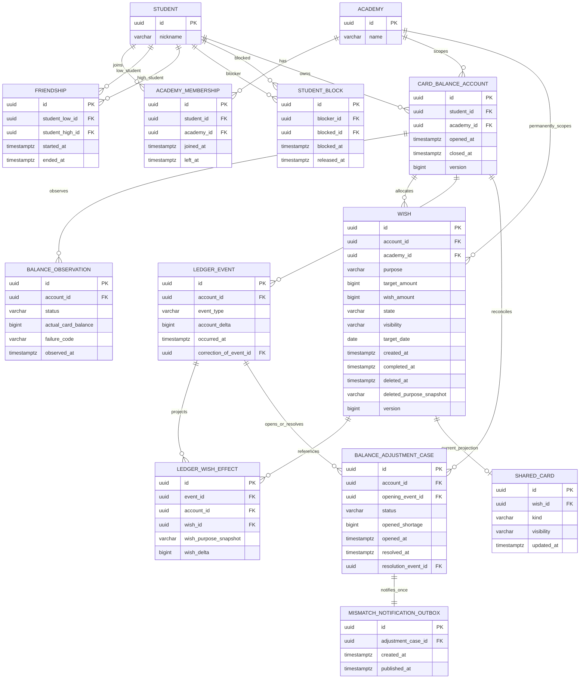

# 위시 데이터 모델과 DB 무결성

이 문서는 위시 기능의 도메인 용어, 관계, 금액과 상태 불변 조건, 트랜잭션 경계를 고정한다. 모든 금액은 소수점 없는 `BIGINT` 원화(KRW)이고 Java에서는 `KrwAmount`로 표현한다. HTTP 계약과 Flyway SQL은 각각 후속 Task 2, 3의 범위다.

## IE 방식 ERD

아래 다이어그램은 IE(Information Engineering) 크로우즈 풋 표기법을 사용한다. `||`는 정확히 하나, `o|`는 0 또는 1, `o{`는 0개 이상을 뜻하며 각 엔터티에는 구현 기준 PK, FK, 주요 필드를 표시한다.



`card_balance_account`는 실물 카드가 아니라 학생과 학원에 귀속된 논리 계정이다. 카드 재발급은 이 식별자를 바꾸지 않는다. `wish.account_id`와 `wish.academy_id`는 생성 후 변경하지 않는다.
`wish(account_id, academy_id)`는 `card_balance_account(id, academy_id)`를 함께 참조하는 복합 FK다. 따라서 존재하는 계정 ID를 사용하더라도 다른 학원의 위시를 연결할 수 없다. 같은 원칙으로 `ledger_wish_effect(event_id, account_id)`와 `(wish_id, account_id)`, 조정 case의 `(opening_event_id, account_id)`와 `(resolution_event_id, account_id)`, 보정 원장의 `(correction_of_event_id, account_id)`를 복합 FK로 묶는다. 원장 projection, 조정, 보정은 다른 카드 계정이나 학원의 사실을 참조할 수 없다.

## 데이터 사전

| 테이블 | 핵심 열 | 의미와 무결성 |
|---|---|---|
| `academy` | `id`, `name` | 위시와 카드 계정의 학원 범위 |
| `student` | `id`, `nickname` | 카드 계정 소유자. 공유 응답은 실명을 저장하거나 노출하지 않는다. |
| `academy_membership` | `student_id`, `academy_id`, `joined_at`, `left_at` | 현재 학원 관계는 `left_at IS NULL`. 학생-학원 쌍은 유일하다. |
| `friendship` | `student_low_id`, `student_high_id`, `started_at`, `ended_at` | 상호 친구 관계. 작은 UUID를 `low`에 두어 순서가 다른 중복을 막는다. 현재 관계는 `ended_at IS NULL`. |
| `student_block` | `blocker_id`, `blocked_id`, `blocked_at`, `released_at` | 방향성 차단. 자기 자신 차단 금지. 현재 차단은 `released_at IS NULL`이며 공유 허용보다 우선한다. |
| `card_balance_account` | `student_id`, `academy_id`, `opened_at`, `closed_at`, `version` | 학생-학원별 활성 논리 계정은 최대 하나. `closed_at IS NULL`이 활성 계정이며 계정 행이 자금 변경의 잠금 경계다. |
| `balance_observation` | `account_id`, `status`, `actual_card_balance`, `failure_code`, `observed_at` | 외부 잔액 조회 한 번의 불변 결과. 성공만 0 이상 실제 잔액을 갖고 실패는 실패 코드를 갖는다. 실패 observation은 마지막 성공 잔액을 바꾸지 않는다. |
| `wish` | `account_id`, `academy_id`, `purpose`, `target_amount`, `wish_amount`, `state`, `visibility`, `target_date`, `created_at`, `completed_at`, `deleted_at`, `deleted_purpose_snapshot`, `version` | 생성 계정과 학원에 영구 귀속. `target_date`는 선택 입력이고 활성 상태에서 수정·삭제할 수 있다. `created_at`은 생성 시 자동 기록하며 `completed_at`은 명시적 완료 시 자동 기록한다. 실제 소요 기간은 두 timestamp의 차이로 파생한다. 활성/상태/금액 및 tombstone 규칙은 아래 표를 따른다. |
| `ledger_event` | `account_id`, `event_type`, `account_delta`, `occurred_at`, `correction_of_event_id` | 실제 사건 하나를 나타내는 append-only 원장 사실. 수정/삭제 대신 보정 사건을 원사건에 연결한다. |
| `ledger_wish_effect` | `event_id`, `account_id`, `wish_id`, `wish_purpose_snapshot`, `wish_delta` | 한 원장 사건을 위시 히스토리에 투영한다. event와 Wish가 같은 계정임을 복합 FK로 보장한다. `(event_id, wish_id)`는 유일하며 이동은 동일 event의 음수/양수 effect 두 개다. 목적 snapshot으로 삭제 뒤에도 문맥을 보존한다. |
| `balance_adjustment_case` | `account_id`, `opening_event_id`, `opened_shortage`, `status`, `resolution_event_id`, 시간 | 실제 잔액 부족 한 회차. opening/resolution event가 case와 같은 계정임을 복합 FK로 보장한다. 계정당 열린 case는 최대 하나이고 해결 사건을 동일 원장 사실에 연결한다. |
| `mismatch_notification_outbox` | `adjustment_case_id`, `created_at`, `published_at` | case당 유일한 알림 outbox. 재발은 새 case이므로 새 알림을 가질 수 있다. |
| `shared_card` | `wish_id`, `kind`, `visibility`, `updated_at` | 위시당 현재 projection 최대 하나. 진행 카드가 목표 도달 시 같은 행에서 100%가 되고 완료 시 `COMPLETION`으로 바뀐다. 수신자 목록은 저장하지 않는다. |

## 상태·금액 규칙

| 상태 | `wish_amount` 조건 | 활성 여부 | 허용 전이 |
|---|---:|---|---|
| `IN_PROGRESS` | `0 <= amount < target_amount` | 활성 | 입금, 출금, 목표 변경, 완료 불가, 포기, 삭제 |
| `AMOUNT_REACHED` | `amount = target_amount` | 활성 | 출금 시 `IN_PROGRESS`, 명시적 완료, 포기, 삭제 |
| `COMPLETED` | `amount = 0` | 최종 | 금액/상태 변경 불가; 삭제 가능 |
| `ABANDONED` | `amount = 0` | 최종 | 금액/상태 변경 불가; 삭제 가능 |

항상 `target_amount > 0`이고 `0 <= wish_amount <= target_amount`다. 완료와 포기는 남은 금액을 같은 트랜잭션에서 계정으로 전액 반환하고 상태를 최종화한다. 완료할 때만 `completed_at`을 기록하며 생성 시각보다 이를 수 없다. `actual_duration`은 별도 저장하지 않고 `completed_at - created_at`으로 계산한다. 포기한 위시에는 완료 시각이 없다. 삭제는 상태 전이가 아닌 독립 command다. 현재 상태를 그대로 보존하면서 남은 금액을 전액 반환하고 `wish_amount = 0`, `deleted_at`, `deleted_purpose_snapshot`을 기록한다. 반환액이 0이면 0원 `ledger_event`를 만들지 않는다. 삭제는 물리 삭제가 아니며 일반 활성 조회에서 제외하고 화면에서는 `삭제된 위시`로 표시한다. 기존 `ledger_wish_effect.wish_purpose_snapshot`과 FK 참조는 유지한다. 완료 위시를 삭제해도 `target_date`, `created_at`, `completed_at`은 보존한다.

`Wish`가 위 규칙을 생성/복원/전이 시 검증하고, Task 3의 PostgreSQL migration은 다음 check를 동일하게 적용한다.

```sql
CHECK (target_amount > 0),
CHECK (wish_amount >= 0 AND wish_amount <= target_amount),
CHECK (
  deleted_at IS NOT NULL OR
  (state = 'IN_PROGRESS' AND wish_amount < target_amount) OR
  (state = 'AMOUNT_REACHED' AND wish_amount = target_amount) OR
  (state IN ('COMPLETED', 'ABANDONED') AND wish_amount = 0)
),
CHECK ((deleted_at IS NULL) = (deleted_purpose_snapshot IS NULL)),
CHECK (deleted_at IS NULL OR wish_amount = 0),
CHECK (
  (state = 'COMPLETED' AND completed_at IS NOT NULL AND completed_at >= created_at) OR
  (state <> 'COMPLETED' AND completed_at IS NULL)
)
```

## 네 가지 잔액

- 실제 카드 잔액(`actual_card_balance`): 마지막 성공 외부 조회가 관측한 0 이상 금액이다.
- 활성 위시 총액(`active_wish_total`): 삭제되지 않은 `IN_PROGRESS`, `AMOUNT_REACHED` 위시 금액의 합이다.
- 원장상 사용 가능 잔액(`ledger_available`): `actual_card_balance - active_wish_total`; 음수를 그대로 보존한다.
- 화면 표시 잔액(`display_available`): `max(0, ledger_available)`이다.
- 미해결 부족액(`unresolved_shortage`): `max(0, -ledger_available)`이다.

이 값들은 서로 대체하지 않는다. `BalanceBreakdown`이 checked integer 연산으로 파생값을 계산한다.

## 원장과 projection

`ledger_event`가 사실의 단일 식별자다. 카드 히스토리, 통합 자금 히스토리, 위시 히스토리는 새 사건을 복제하지 않고 event와 effect를 조회한다. 위시 간 30원 이동은 같은 활성 계정·학원에 속한 두 위시에 대해서만 `WISH_TRANSFER` event 하나, 출발 위시 `-30` effect 하나, 도착 위시 `+30` effect 하나로 저장한다. 따라서 계정 실제 잔액과 활성 위시 총액은 바뀌지 않고 두 위시 projection만 변한다. append-only 정책상 이미 기록된 사건은 갱신/삭제하지 않고 같은 계정의 `correction_of_event_id`가 원사건을 가리키는 보정 사건을 추가한다.

## 관계 기반 공유

`shared_card`는 수신자 목록이 아닌 현재 공개 projection만 보관한다. 읽을 때마다 현재 `academy_membership`, 현재 `friendship`, 양방향 `student_block`을 판정한다. 학원 이탈, 친구 해제, 어느 방향이든 차단이 생기면 과거 공개 대상도 즉시 제외된다. `PRIVATE`은 공유 카드가 없고, 삭제는 현재 카드를 제거한다. 정확한 위시 금액, 카드 식별자, 원장, 실명은 공유 projection에 포함하지 않는다.

## 트랜잭션과 잠금

자금을 바꾸는 command는 `card_balance_account` 한 행을 `SELECT ... FOR UPDATE`로 잠그는 단일 트랜잭션이다. 영향을 받는 위시는 UUID 오름차순으로 잠가 교착 순서를 고정한다. 잠금 뒤 실제 잔액, 활성 위시 총액, 열린 조정 건을 다시 읽고 다음을 원자적으로 커밋한다.

1. 위시 금액과 상태 변경
2. `ledger_event`와 모든 `ledger_wish_effect` 추가
3. 조정 case 생성·해결 및 해결 event 연결
4. case 최초 생성 시 outbox 한 건 추가
5. 현재 `shared_card` 갱신·제거

낙관적 `version`은 stale command를 탐지하고, 계정 비관 잠금이 잔액 배분의 직렬화 경계다.

## JPA 제약과 PostgreSQL 전용 제약(Task 3)

현재 JPA mapping은 모든 `*_id`의 FK, 계정·학원 소유권 복합 FK, 일반 unique, 상태·금액·tombstone·관계 check를 생성한다. `wish`, `ledger_event`, `ledger_wish_effect`의 참조에는 cascade delete가 없고, 원장 엔터티는 JPA lifecycle에서도 갱신·삭제를 거부한다. Task 3 migration은 같은 portable 제약을 명시적으로 고정하고 다음 PostgreSQL partial unique index를 추가한다. 이 Task에서는 migration 파일을 만들지 않는다.

```sql
CREATE UNIQUE INDEX uk_card_account_active
  ON card_balance_account(student_id, academy_id) WHERE closed_at IS NULL;
CREATE UNIQUE INDEX uk_adjustment_case_open
  ON balance_adjustment_case(account_id) WHERE status = 'OPEN';
CREATE UNIQUE INDEX uk_shared_card_current_wish ON shared_card(wish_id);
CREATE UNIQUE INDEX uk_mismatch_notification_case
  ON mismatch_notification_outbox(adjustment_case_id);
```

`friendship`의 `student_low_id < student_high_id`, `student_block`의 `blocker_id <> blocked_id`, 성공 observation의 실제 잔액 필수와 실패 observation의 실제 잔액 금지는 portable check로 이미 mapping되어 있다. Task 3에서는 PostgreSQL Testcontainers로 migration DDL과 partial index까지 검증한다.

## 요구사항 추적표

| Riido 2-42 규칙 | 모델/제약 |
|---|---|
| 상태와 금액의 일치, 최종 상태 | `Wish`, `WishState`, Wish check |
| 목적·목표 금액·선택 목표일과 생성일 보존 | `wish.purpose`, `target_amount`, `target_date`, `created_at` |
| 완료일 자동 기록과 실제 소요 기간 계산 | 완료 상태 전용 `wish.completed_at`, `completed_at >= created_at` check, `Wish.actualDuration()` |
| 학생-학원별 논리 카드 계정 | `card_balance_account`, 활성 partial unique, `CardBalanceAccountRules` |
| 실제/원장/표시/부족 잔액 분리 | `balance_observation`, `BalanceBreakdown` |
| 불변 히스토리와 중복 없는 사실 | `ledger_event`, `ledger_wish_effect`, 보정 연결 |
| 이동 한 건의 양쪽 위시 기록 | event 하나 + source/destination effect 둘 |
| 불일치 회차와 1회 알림 | 열린 case partial unique + outbox case unique |
| 진행/완료 공유 projection 하나 | `shared_card.wish_id` unique, `kind` 갱신 |
| 현재 친구·학원·차단 우선 판정 | 기간 열이 있는 관계 테이블, 수신자 snapshot 없음 |
| 삭제 후 상태·원장 문맥과 표시 보존 | 상태 비변경 tombstone + Wish/effect 목적 snapshot, cascade delete 금지 |

`WishDomainInvariantTest`, `MoneyValueTest`, `WishStateConstraintTest`가 도메인 불변 조건, 선택 목표일의 활성 상태 수정, 완료일 자동 기록, 실제 소요 기간 계산, 동일 활성 계정·학원 안에서만 가능한 위시 이동, 진행 중·목표 금액 달성·완료·포기 상태에서의 독립 삭제 동작을 검증한다. `WishPersistenceIntegrityTest`는 H2 persistence 경계에서 목표일·생성일·완료일 보존, 유효 그래프 저장, FK·unique·check 거부, 위시-계정 학원 일치, 원장 effect와 조정 event의 계정 소유권, append-only 원장, 상태별 tombstone 보존과 활성 조회 제외를 검증한다. 실제 PostgreSQL migration과 partial unique 거부는 Task 3의 Testcontainers 통합 테스트에서 검증한다.
